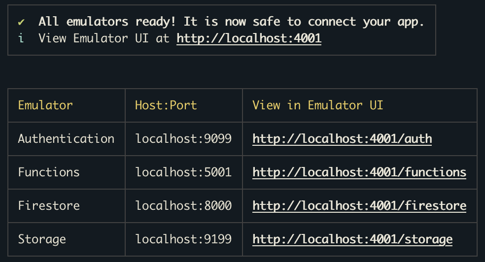

# flutter-III

### Firebase initialization

**<ins>Step 1</ins>**

Install node14


[node14 download link](https://nodejs.org/gl/blog/release/v14.0.0/)


**<ins>Step 2</ins>**

```cd functions```

```npm install```

```npm run build```

**<ins>Step 3</ins>**

```cd functions```

```run "firebase emulators:start"```

the result should be like this:



**<ins>Step 4</ins>**

You will now seed the database

run ```cd functions/```

run ```npm run db:seed``` or ```npx ts-node seed.ts``` npx ts-node seed.ts(warning: don't run this cmd more than once)

**<ins>Step 5</ins>**

Once you have created an account by using the app, please go to the Firestore UI (e.g. http://localhost:4001/firestore)
And manually modify the role from USER to ADMIN

Now you can test other features
